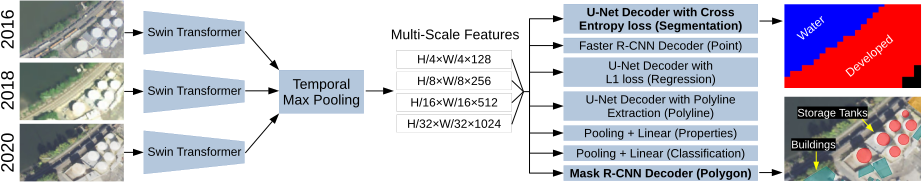

## Model Architecture

The current models deployed in Satlas reuse the SatlasNet architecture from our [SatlasPretrain paper](https://arxiv.org/abs/2211.15660).

1. For each inference window, multiple aligned images (either 3 or 4, see `NumImages` option in `configs/satlas_explorer_X.txt`) of the same spatial window captured at different times are retrieved.
2. The input images are normalized so that values are between 0-1. See [Normalization.md](Normalization.md) for details.
3. A Swin-v2-Base backbone is applied on each image to obtain four feature maps, at 1/4, 1/8, 1/16, and 1/32 of the original resolution. See the [Swin Transformer V2 paper](https://arxiv.org/abs/2111.09883) for details.
4. On each of the feature maps, we apply max pooling on the temporal dimension, i.e., across the multiple aligned images.
5. A feature pyramid network is applied across feature maps to combine coarse and fine grained representations. This produces four final feature maps that each have 128 channels. See the [FPN paper](https://arxiv.org/abs/1612.03144) for details.
5. The feature maps are passed to a Faster R-CNN head to detect points, or a U-Net-style decoder head to detect solar farms (segmentation) and tree cover (regression).

The model is implemented in `satlas/model/model.py`.
Configuration files in `configs/` define different components like the Swin Transformer backbone, FPN, and heads that are combined to create the model.

## Prefixes in .pth files

The components of the model have these prefixes in the .pth weights:

- `backbone.backbone.backbone.`: the Swin-v2-Base backbone from `torchvision.models.swin_v2_b()`.
- `intermediates.0.fpn.`: the FPN from `torchvision.ops.FeaturePyramidNetwork(in_channels_list=[128,256,512,1024], out_channels=128)`.
- `heads.0.`: the prediction head.